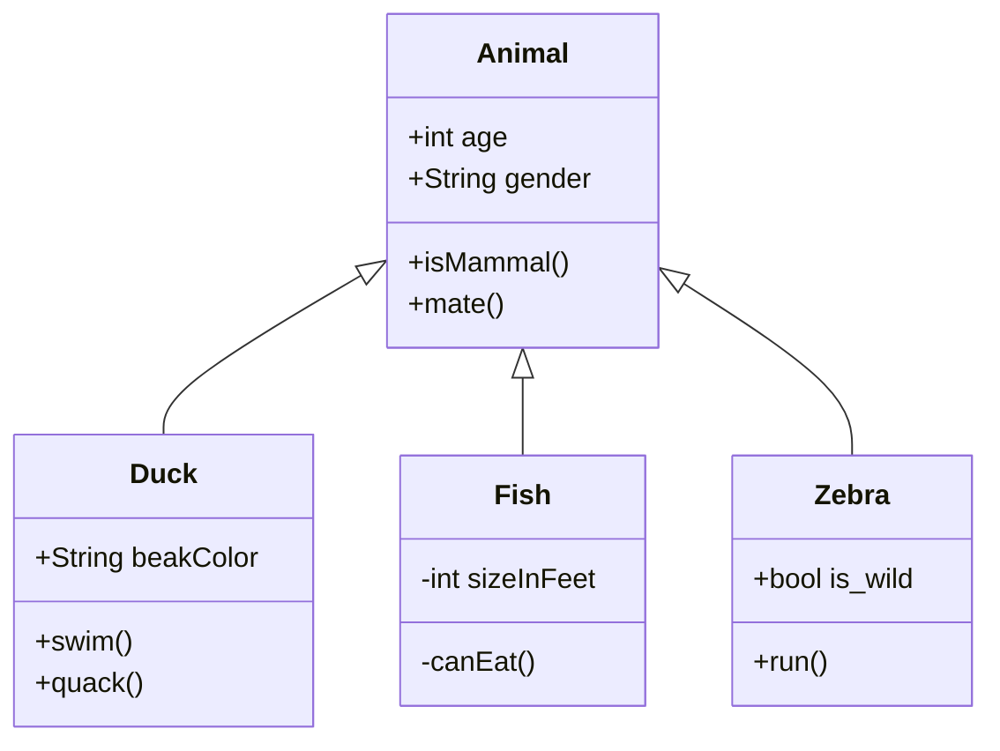

# 背景
VSCode(VSNote + mermaid拡張)でノートを書いて静的サイトジェネレータを使ってWebから見れるようにしたい。  
静的サイトジェネレータは扱いが簡単でVSNoteと同じ形式でタグが扱えるHUGOを採用。  
元々PlantUMLを使って図を書いていたが、現時点でHUGOはPlantUMLに対応していない。  
その他のグラフ描画ツールとしてmermaid.jsには対応しているが、設定が必要。

# 結論
図を含むページが表示されるときに以下のスクリプトを実行できれば、ショートコードを使わず、通常のmarkdownのシンタックスハイライトの記法でmermaidの図を表示させることができる。

### 記述するコード
```html
<script src="https://cdnjs.cloudflare.com/ajax/libs/mermaid/8.4.4/mermaid.min.js"></script>
<script>
    window.onload = function() {
        mermaid.init(undefined, ".language-mermaid");
    };
</script>
```

### markdwonファイル内の記述
````

````

### 表示される図


# 詳細
私が使っているテーマ(
 [Hugo Notepadium \| Hugo Themes](https://themes.gohugo.io/hugo-notepadium/)
)では以下のようなフォルダ構成になっており、記事ページ表示時の処理は`single.html`に記述されている。


最低限の作業で済ますためにこの`single.html`の先頭に先ほどのスクリプト部分を追加する。作業自体はこれだけで終了。mermaidの記述を含むMarkdownファイルをHUGOに投入して、正しくは図が表示されていれば成功。

きれいに作るならスクリプトなど前処理をまとめたファイルを`single.html`とは別に作成してそのファイルに独自処理をまとめる、などした方が後のメンテナンスが楽になるはず。

# 参考
[Mermaid :: Documentation for Hugo Learn Theme](https://learn.netlify.com/en/shortcodes/mermaid/)

[Hugoでmermaidを使う \| blue271828's misc :\-\)](https://www.blue271828.com/howtos/hugo%E3%81%A7mermaid%E3%82%92%E4%BD%BF%E3%81%86/#%E3%82%B3%E3%83%BC%E3%83%89%E3%83%95%E3%82%A7%E3%83%B3%E3%82%B9%E3%81%8B%E3%82%89mermaid%E3%82%92%E4%BD%BF%E3%81%86)
