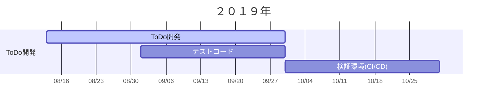

---
tags:
  - develop
  - Memo
  - idea
---

# ToDoアプリ開発計画
作成日：2019/08/12

---
## 要件

## バックログ

- [x] 4:ログイン機能
    - [x] 1:ログインできる
    - [x] 2:ユーザー登録できる
        - [x] 1:バリデーションが効く
        - [x] 1:メッセージ作成
    - [ ] 1:ログアウトできる
- [ ] 9:ToDo機能
    - [x] 4:タスク一覧表示
    - [x] 1:タスク作成
    - [x] 2:タスク削除
    - [ ] 1:タスク名称変更
    - [x] 1:タスク完了
- [ ] 14:追加機能１
    - [x] 4:テスト駆動の追加
    - [ ] 2:完了タスクのフィルタ切替
    - [ ] 2:認可の整理
    - [ ] 6:DB接続
        - [ ] 4:DB構築
        - [ ] 2::接続
- [ ] 追加機能２
    - [ ] タスクの並び替え
    - [ ] 複数リストの作成
    - [ ] リスト間のタスク移動
    - [ ] ポモドーロ見積・実績
    - [ ] レポート（タスク数、ポモドーロ数）
    - [ ] Webアプリとして環境整備

