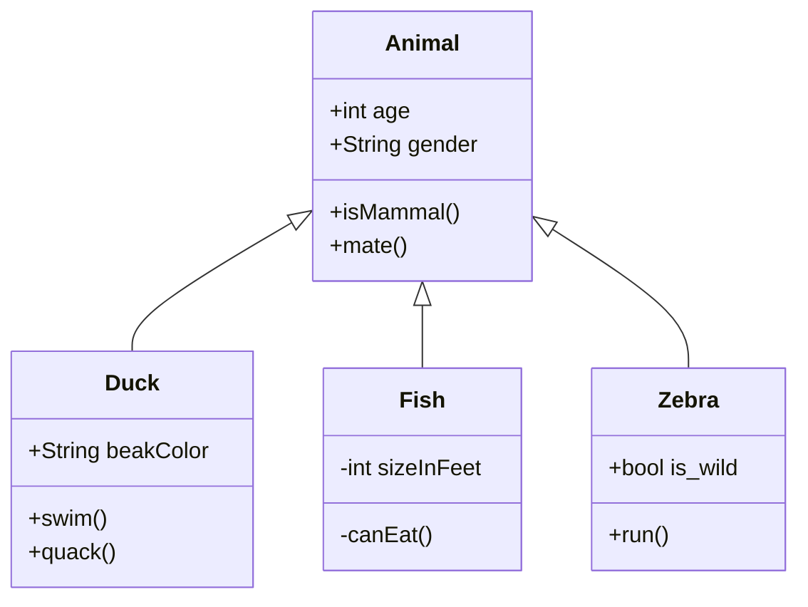
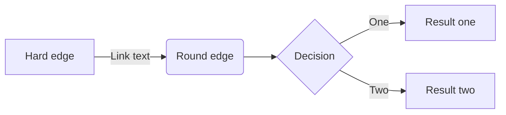
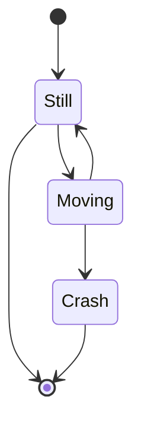
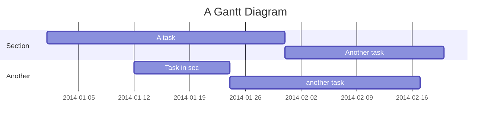
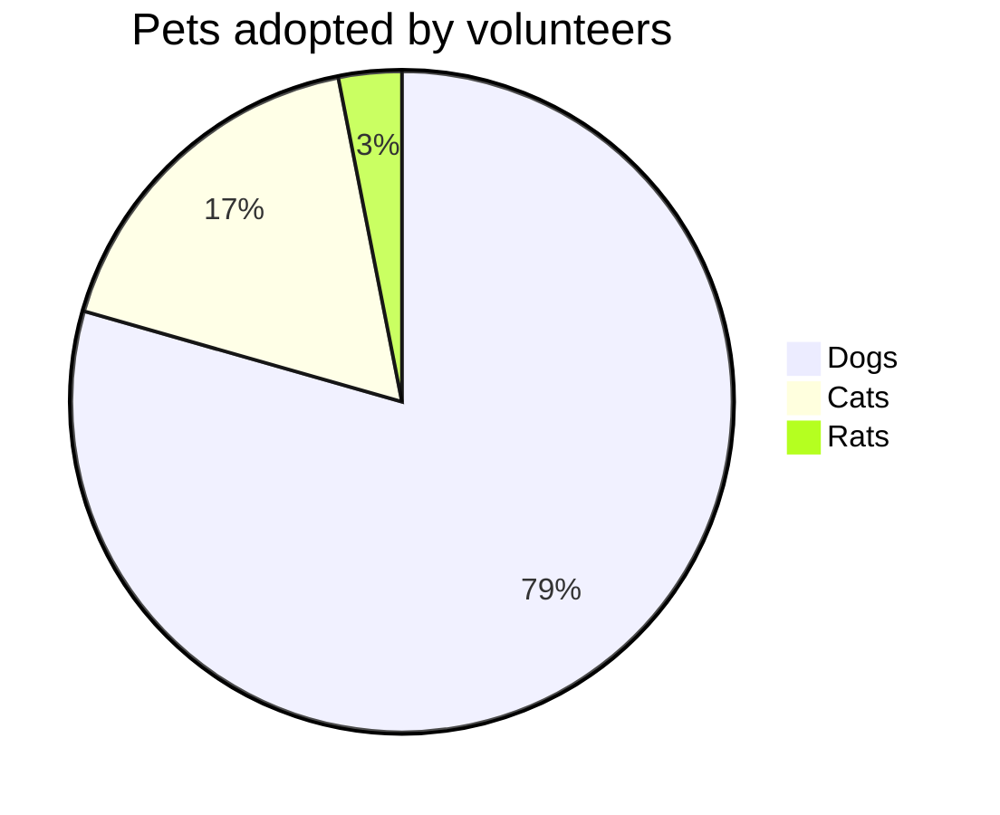

[mermaidを使ってMarkdownでシーケンス図を作成 \- Qiita](https://qiita.com/poro1985/items/b23bad93bf721a195f15)

[mermaid\.jsが素晴らしいけどなかなか使ってる人見かけないので実例晒す\(追記あり\) \- Qiita](https://qiita.com/uzuki_aoba/items/a01f8b0b52ced69c8092)

[mermaid \- Markdownish syntax for generating flowcharts, sequence diagrams, class diagrams, gantt charts and git graphs\.](https://mermaid-js.github.io/mermaid/#/)

# VSCodeで書いてみる
[Markdown Preview Mermaid Support](https://marketplace.visualstudio.com/items?itemName=bierner.markdown-mermaid)
の拡張をインストールする。

VSCodeで適当なMarkdownファイルを開き、`mermaid`コードハイライト内に以下のように記述する。（mermaid公式より）

```
classDiagram
      Animal <|-- Duck
      Animal <|-- Fish
      Animal <|-- Zebra
      Animal : +int age
      Animal : +String gender
      Animal: +isMammal()
      Animal: +mate()
      class Duck{
          +String beakColor
          +swim()
          +quack()
      }
      class Fish{
          -int sizeInFeet
          -canEat()
      }
      class Zebra{
          +bool is_wild
          +run()
      }
```

VSCode標準のプレビュー(Open Preview to the side)を表示すると下のようなクラス図が表示される。


クラス図の他にも以下の図を書くことができる。
* フローチャート
* 状態遷移図
* シーケンス図
* ガントチャート
* 円グラフ

以下、公式のサンプルより抜粋。
#### フローチャート
```
graph LR
    A[Hard edge] -->|Link text| B(Round edge)
    B --> C{Decision}
    C -->|One| D[Result one]
    C -->|Two| E[Result two]
```



#### 状態遷移図
```
stateDiagram
    [*] --> Still
    Still --> [*]

    Still --> Moving
    Moving --> Still
    Moving --> Crash
    Crash --> [*]
```



#### シーケンス図

```
stateDiagram
    [*] --> Still
    Still --> [*]

    Still --> Moving
    Moving --> Still
    Moving --> Crash
    Crash --> [*]
```


#### ガントチャート
```
gantt
    title A Gantt Diagram
    dateFormat  YYYY-MM-DD
    section Section
    A task           :a1, 2014-01-01, 30d
    Another task     :after a1  , 20d
    section Another
    Task in sec      :2014-01-12  , 12d
    another task      : 24d
```



#### 円グラフ
```
pie 
    title Pets adopted by volunteers
    "Dogs" : 386
    "Cats" : 85
    "Rats" : 15 
```

