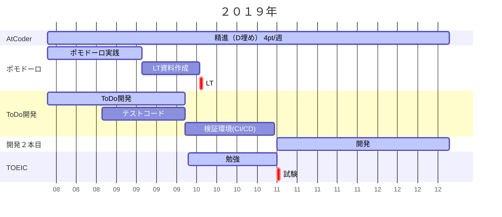

---
tags:
  - Note
  - plan
---

# 長期計画２０１９
作成日：2019/08/12

---
## 目標：アーキテクト ＋ 育成者
- 広範な技術を学び実用することで比較検討できる
- 適切に直接指導できる
- 指導方法を指導できる

## 長期計画

### 2019年（30歳）
#### できること
- Java/C#でWebアプリ構築〜CI/CD説明できる
- Java/C#がEffectiveJavaレベルで語れる
- ポモドーロテクニック マスター

#### スキル・資格
- SpringBoot / C#.Net
- JUnit / NUnit
- AtCoder水色

#### やりたいこと

---
### 2020年（31歳）
#### できること
- Kaggle画像コンペSubmitできる
- Androidアプリ作れる(スタンドアローン、サーバー連携)
- 小規模〜中規模の設計・テストが語れる（設計パターンを一通りカバー）
- コーチング（後輩指導）が語れる

#### スキル・資格
- DBスペシャリスト（春）
- TOEIC８００点 ：11月
- 画像コンペ銅メダル

#### やりたいこと
- マイクロサービスアーキテクチャでアプリを作る
- ポモドーロアプリ作ってリリースしたい
- Windowsストアアプリ作ってリリース

---
### 2021年（32歳）
#### できること
- 中規模の設計・テストが語れる
- コーチングが語れる
#### スキル・資格
- NWスペシャリスト（秋）
- TOEIC８５０点 ：11月
#### やりたいこと

---
### 2022年（33歳）

#### できること
- 英語に自信あり
- チーム規模（１０名）のマネジメントが語れる
- 中規模の設計・テストが語れる
#### スキル・資格
- PM系資格
- TOEFL
#### やりたいこと
コーチング系の資格とりたい

---
### 2023年（34歳）

#### できること
-  
#### スキル・資格

#### やりたいこと

## 年間計画２０１９
